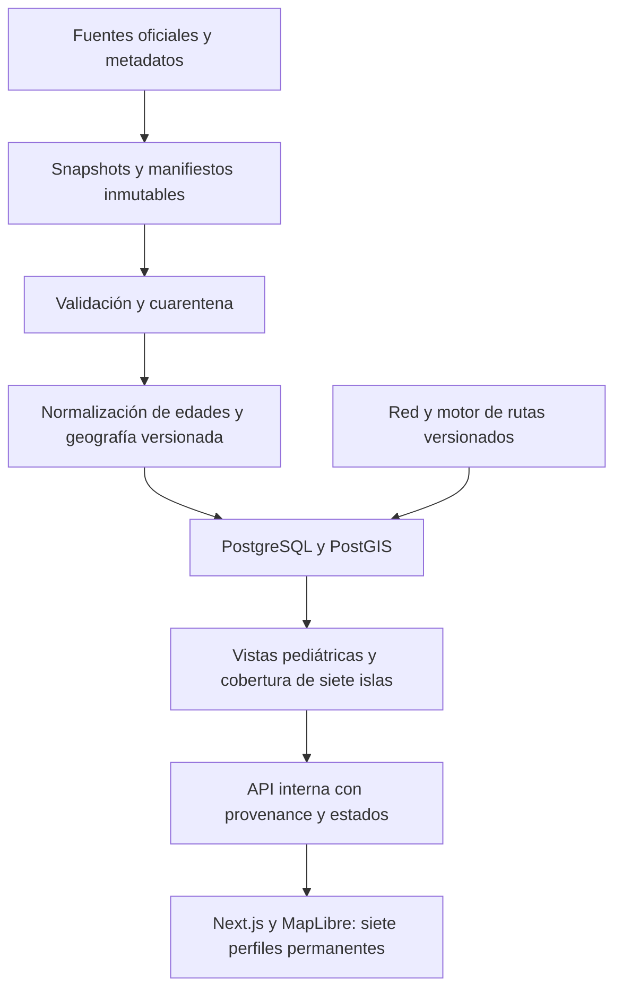

# Arquitectura propuesta — resistente a datos incompletos

Decisión de FASE 0, no implementación. Stack del brief: Next.js + TypeScript + React + MapLibre GL; PostgreSQL/PostGIS; Python con pandas/polars, GeoPandas, pyogrio y httpx; análisis Python/R/SQL. Las versiones se fijarán en lockfiles al iniciar implementación, no se presupone «latest».

## Decisiones

- Monolito modular inicialmente: API interna de lectura en Next.js, procesos Python separados para ingesta y cálculos pesados. Evitar microservicios prematuros.
- PostgreSQL conserva datos normalizados y metadatos; PostGIS geometrías versionadas. Ficheros grandes en almacenamiento de objetos, no Git. Git contiene documentos, manifiestos, contratos y pequeñas evidencias públicas.
- Ingesta idempotente con `dataset_version + source_key`; checksum, URL exacta, licencia, timestamp y versión del parser. Cambios en fuente crean versiones nuevas, no sobrescritura silenciosa.
- Zonas raw/staging/curated/publication. La promoción es atómica; si una actualización falla, mantener última versión válida marcada con su fecha.
- Una dimensión canónica de siete islas genera todas las salidas mediante LEFT JOIN. Ausencia en observaciones nunca elimina una isla.
- Coverage es entidad propia por variable/isla/periodo/edad, con motivo, evidencia y acciones pendientes. La disponibilidad sanitaria se modela aparte de disponibilidad estadística.
- API devuelve `value=null` con `value_status` y `missing_reason`; valor cero válido es `value=0, observed`. La UI usa «Pendiente de validación», «Suprimido» o «No disponible públicamente para esta isla» solo según evidencia.
- Datos Canarias/provincia usan `island_id=null` y geografía correcta; no replicar cifras a siete registros ficticios.

## Contrato orientativo API

`GET /api/islands` siempre devuelve los siete IDs. `GET /api/indicators?indicator=...&period=...` devuelve siete posiciones insulares cuando se solicita comparación, más metadata de niveles agregados disponibles. Cada posición incluye disponibilidad, edad original, fuente, periodo, numerador/denominador, incertidumbre y limitaciones. `GET /api/sources/:id` y `/api/methods/:id` sostienen «Fuente y metodología».

La respuesta puede mostrar información regional como contexto, etiquetada, sin convertirla en observación de isla. Exportación futura aplica las mismas reglas de supresión que la interfaz.

## GIS

Conservar CRS original. Salida web EPSG:4326, visualización web Mercator; distancias/áreas en CRS métrico canario validado (candidato REGCAN95/UTM 28N, EPSG:4083, confirmar en metadatos). No calcular áreas en grados ni fiarse del orden de ejes WFS. Malla auditada devuelve 4326.

Geometrías: `ST_IsValid`, anillos, duplicados, vacíos, solapes, huecos, cobertura insular y coincidencia de códigos. Correcciones geométricas se versionan; nunca `make_valid` silencioso. ZBS pueden cortar municipios. Mantener tabla de correspondencias y vigencia, no join por nombre libre.

Población por ZBS: preferir asignación oficial TIS para carga AP. Para residentes, intersección de malla permite una estimación espacial, no un conteo exacto. Registrar pesos de asignación; área uniforme solo como supuesto explícito con sensibilidad a centroides/puntos habitados. Conservar masa, tratar celdas fronterizas y no crear datos 0–17 a partir de la malla 0–14.

## Routing: comparación y elección provisional

|Motor|Ventaja|Coste/limitación|Decisión|
|---|---|---|---|
|OpenRouteService|Matrices e isócronas documentadas, autohospedable|Preparación de grafo/recursos; servicio alojado sujeto a cuotas|Primera opción de prueba|
|OSRM|Route/Table, matrices de tiempos eficientes|API consultada sin isócronas nativas|Comparador de tiempos y alternativa si solo matrices|
|Valhalla|Rutas, matrices e isócronas; perfiles flexibles|Mayor configuración/operación|Alternativa si se necesitan costes avanzados|
|GraphHopper|API de rutas/isócronas y opciones gestionadas|Verificar términos, cuotas y coste|Alternativa gestionada|

Documentación primaria S33–S36. Ningún motor queda certificado para Canarias por el mero soporte de OSM. No se ha ejecutado benchmark ni se ha calculado accesibilidad en FASE 0.

Benchmark posterior: por cada isla, ruta urbana, rural, extremo territorial, sentido inverso y caso sin ruta; destinos con entrada asistencial verificada; comprobar snapping, vías prohibidas, pendientes de acceso y cortes. Fijar snapshot OSM, versión, perfil y exclusión de ferris para acceso intrainsular. Revisar diferencias entre motores y casos extremos con conocimiento local. Medir tiempo de desplazamiento por carretera, no tiempo hasta recibir asistencia ni transporte sanitario urgente.

Isócronas con dirección correcta hacia el centro; red dirigida implica que salida y llegada no son simétricas. Calcular indicadores con matriz origen→destino y ponderación infantil, no superficie de polígonos. Tratar 5/10/15/20/30 minutos; el literal «> 1.» del brief es ambiguo: propuesta >30 min, pendiente confirmación antes de implementarlo.

Si no hay UCIP/UCIN confirmada en una isla: no dibujar ruta terrestre a otra. `requires_interisland_transfer` con destino de referencia confirmado y tiempo desconocido. Un modelo separado incluiría activación, estabilización, disponibilidad, espera, vuelo/barco y traslado terrestre; no sumar horarios comerciales para simular evacuación clínica.

## Operación y seguridad

Solo estadísticas públicas agregadas. Repositorio sin API keys, historias clínicas ni microdatos identificables. Credenciales AEMET en secretos del entorno; no URLs con token en logs. Actualizaciones: población/SIAP/mortalidad/EMH anuales; ESC por edición; aire/meteo según producto validado, no según una frecuencia deseada.

Refresh descarga condicional con ETag/Last-Modified cuando exista, límites de tasa y reintentos acotados. Fallos generan informe; un año faltante no provoca interpolación automática. Observabilidad registra cobertura, nulos, periodos, duplicados y desviaciones; revisión de licencia antes de redistribuir nuevas fuentes. Documentar costes reales tras benchmark, sin estimación comercial inventada.
